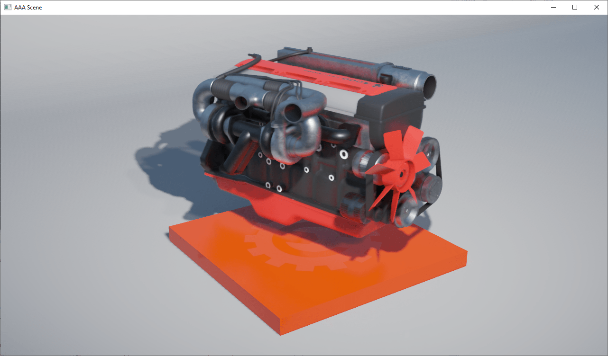
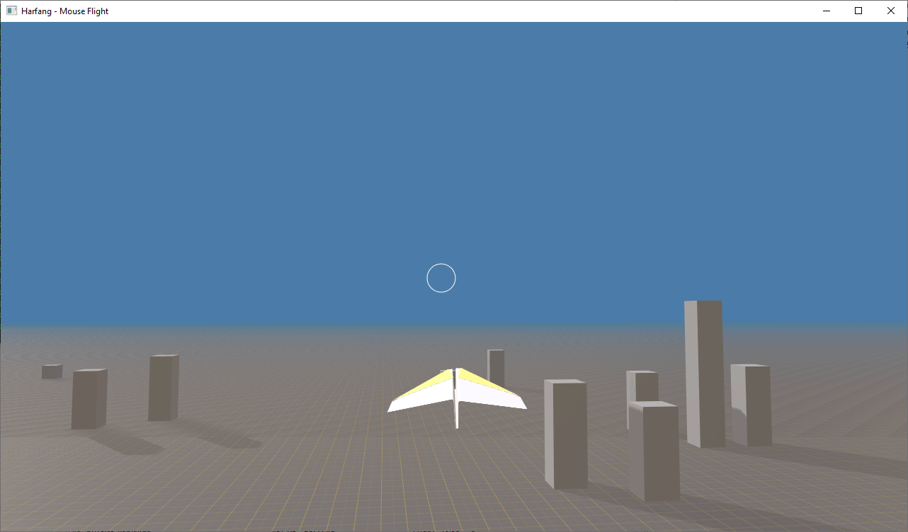
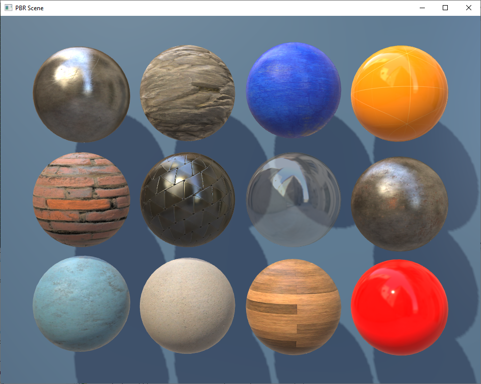
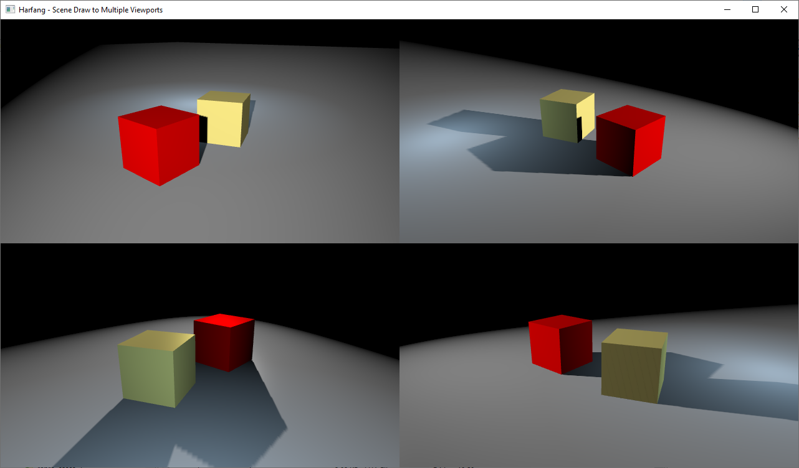
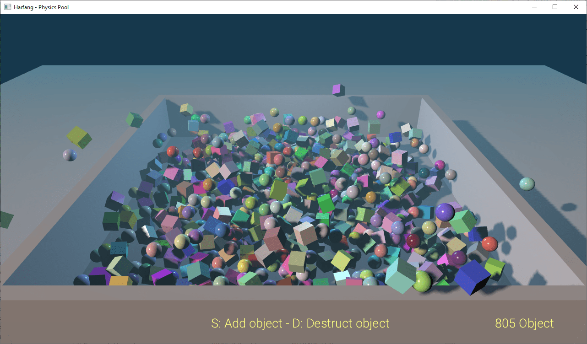
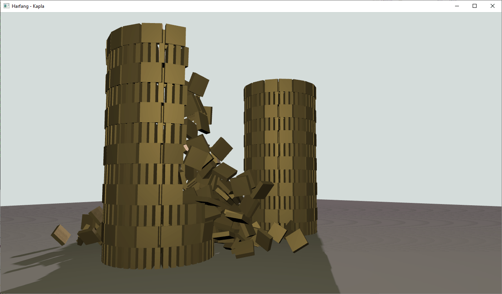
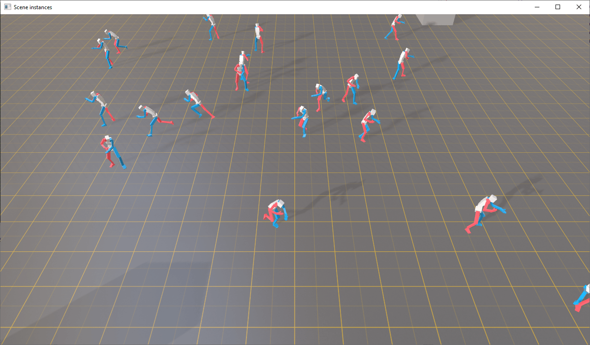
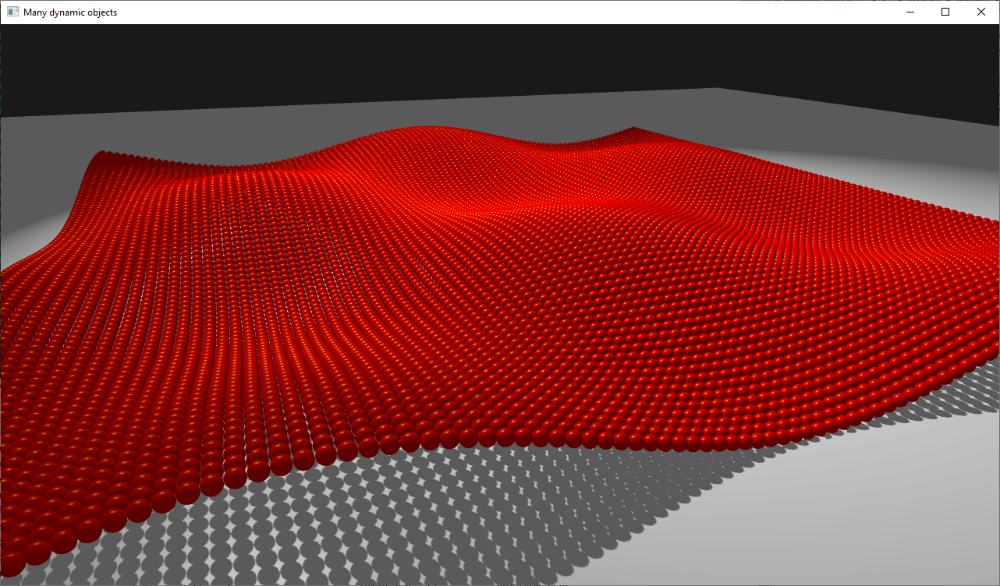
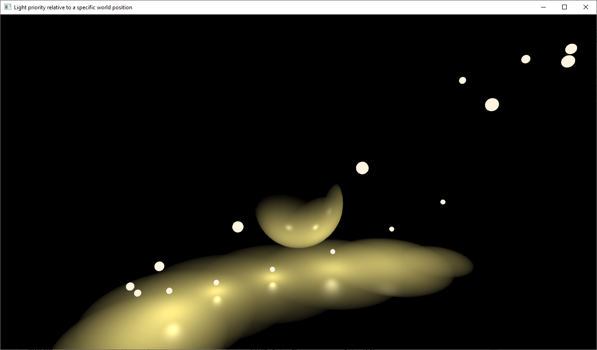
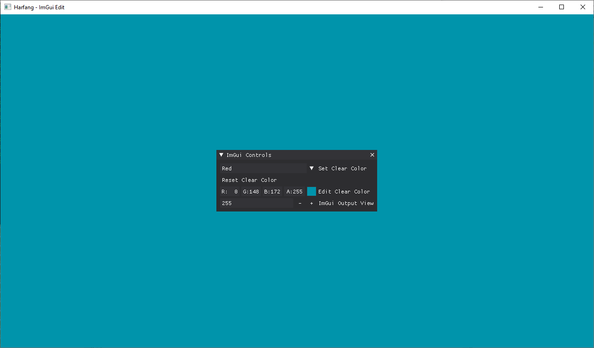

# HARFANG® Tutorials

These **tutorials** demonstrate the usage of the HARFANG API in **Python** and **Lua**.

To run the tutorials:

1. Download or clone this repository to your computer _(eg. in `d:/tutorials-hg2`)_.
2. Download _assetc_ for your platform from [here](https://harfang3d.com/releases) to compile the tutorial resources.
3. Drag and drop the tutorial resources folder on the assetc executable **-OR-** execute assetc passing it the path to the tutorial resources folder _(eg. `assetc d:/tutorials-hg2/resources`)_.


After the compilation process finishes, you will see a `resources_compiled` folder next to the tutorials resources folder.

You can now execute the tutorials from the folder you unzipped them to.

```bash
D:\tutorials-hg2>python draw_lines.py
```
or
```bash
D:\tutorials-hg2>lua draw_lines.lua
```

Alternatively, you can open the tutorial folder using [Visual Studio Code](https://code.visualstudio.com/) and use the provided debug targets to run the tutorials.

**If you want to know more about HARFANG**, please visit the [official website](https://www.harfang3d.com).

## Screenshots
* AAA Rendering Pipeline


* Mouse flight controller


* PBR materials


* Draw to multiple viewports


* Physics pool of objects


* Physics Kapla


* Scene Instances


* Scene with many nodes


* Forward rendering pipeline, using the lights priority


* Dear ImGui edition

